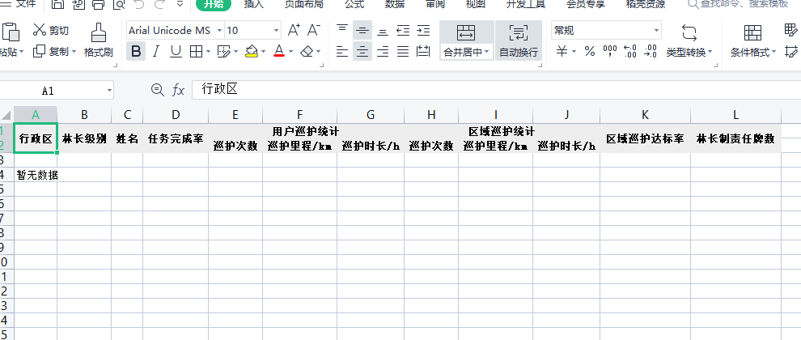
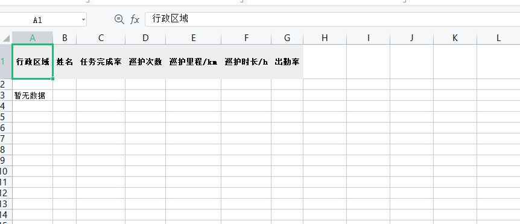

# vue 下载表格模板






# vue 下载模板

## 代码（html）

```sh
<template>
	<div style="height: -webkit-fill-available; background-color: #fff">
		<!-- style="height:100%;height: -webkit-fill-available;background-color: #fff;" -->
		<!-- 基层组织设施 -->
		<div class="form">
			<div class="form-search">
				<span class="form-tit">筛选:</span>
				<!-- <el-form-item label=""> </el-form-item> -->
				<el-form :inline="true" :model="formInline" class="demo-form-inline">
					<el-form-item label="行政区/市" v-if="userList.level == 1">
						<el-select v-model="areaSelect.city" disabled>
							<el-option
								@click.native="handeleArea(item)"
								v-for="item in areaList"
								:label="item.deptName"
								:value="item.id"
								:key="item.id"
							></el-option>
						</el-select>
					</el-form-item>
					<el-form-item label="县" v-if="userList.level <= 2">
						<el-select :disabled="userList.level == 2" v-model="areaSelect.county">
							<el-option
								@click.native="handeleArea(item)"
								v-for="item in areaL.county"
								:label="item.deptName"
								:value="item.id"
								:key="item.id"
							></el-option>
						</el-select>
					</el-form-item>

					<el-form-item label="乡/镇" v-if="userList.level <= 3">
						<el-select :disabled="userList.level == 3" v-model="areaSelect.township">
							<el-option
								@click.native="handeleArea(item)"
								v-for="item in areaL.township"
								:label="item.deptName"
								:value="item.id"
								:key="item.id"
							></el-option>
							<!-- <el-option label="区域二" value="beijing"></el-option> -->
						</el-select>
					</el-form-item>
					<el-form-item label="村" v-if="muenIndex == 1">
						<el-select :disabled="userList.level == 4" v-model="areaSelect.village">
							<el-option
								@click.native="handeleArea(item)"
								v-for="item in areaL.village"
								:label="item.deptName"
								:value="item.id"
								:key="item.id"
							></el-option>
							<!-- <el-option label="区域二" value="beijing"></el-option> -->
						</el-select>
					</el-form-item>

					<el-form-item label="选择时间">
						<el-date-picker
							v-model="formInline.timeRange"
							type="daterange"
							format="yyyy-MM-dd"
							value-format="yyyy-MM-dd "
							range-separator="-"
							start-placeholder="开始日期"
							end-placeholder="结束日期"
						>
						</el-date-picker>
					</el-form-item>
					<el-form-item>
						<el-button @click="handleReset">重置</el-button>
						<el-button type="primary" @click="onSubmit">查询</el-button>
					</el-form-item>
				</el-form>
			</div>
			<el-button class="form-exp-btn" @click="handleExport">导出报表</el-button>
		</div>
		<div class="muen">
			<div class="muen-item">
				<span
					:class="{ 'span-bd': muenIndex == 0 }"
					@click="
						() => {
							muenIndex = 0
							formInline.level = 0
						}
					"
					>林长</span
				>
				<span
					:class="{ 'span-bd': muenIndex == 1 }"
					@click="
						() => {
							muenIndex = 1
							formInline.level = 1
						}
					"
					>管护员</span
				>
			</div>
		</div>
		<div class="table-box" v-show="muenIndex == 0">
			<el-table
				class="html-tabel"
				:header-cell-style="{ background: '#eee', borderColor: '#ccc', 'text-align': 'center' }"
				:data="tableData"
				style="width: 100%"
			>
				<el-table-column prop="deptName" label="行政区"> </el-table-column>
				<el-table-column prop="level" label="林长级别"> </el-table-column>
				<el-table-column prop="userName" label="姓名"> </el-table-column>
				<el-table-column prop="taskCompletionRate" label="任务完成率" sortable min-width="130"> </el-table-column>
				<el-table-column label="用户巡护统计">
					<el-table-column prop="userPatrolNum" label="巡护次数" sortable min-width="130"> </el-table-column>
					<el-table-column prop="userPatrolMileage" label="巡护里程/km" sortable min-width="130"> </el-table-column>
					<el-table-column prop="userPatrolDuration" label="巡护时长/h" sortable min-width="130"> </el-table-column>
				</el-table-column>
				<el-table-column label="区域巡护统计">
					<el-table-column prop="deptPatrolNum" label="巡护次数" sortable min-width="130"> </el-table-column>
					<el-table-column prop="deptPatrolMileage" label="巡护里程/km" sortable min-width="130"> </el-table-column>
					<el-table-column prop="deptPatrolDuration" label="巡护时长/h" sortable min-width="130"> </el-table-column>
				</el-table-column>
				<el-table-column prop="ComplianceRate" label="区域巡护达标率" sortable min-width="150"> </el-table-column>
				<el-table-column prop="ResponsibilityCard" label="林长制责任牌数" sortable min-width="150"> </el-table-column>
			</el-table>
		</div>
		<span class="table-box" v-show="muenIndex == 1">
			<el-table :data="tableData2" style="width: 50%" :header-cell-style="{ background: '#eee', height: '57px' }" class="tab-xx html-tabel2">
				<el-table-column prop="deptName" label="行政区域"> </el-table-column>
				<el-table-column prop="userName" label="姓名"> </el-table-column>
				<!-- <el-table-column prop="date" label="姓名" width="150"> </el-table-column> -->
				<el-table-column prop="taskCompletionRate" label="任务完成率" sortable min-width="130"> </el-table-column>
				<el-table-column prop="deptPatrolNum" label="巡护次数" sortable min-width="130"> </el-table-column>
				<el-table-column prop="deptPatrolMileage" label="巡护里程/km" sortable min-width="130"> </el-table-column>
				<el-table-column prop="deptPatrolDuration" label="巡护时长/h" sortable min-width="130"> </el-table-column>
				<el-table-column prop="attendance" label="出勤率" sortable min-width="130"> </el-table-column>
			</el-table>
			<div class="echart-box">
				<div class="box-top" id="box-top"></div>
				<div class="box-bottom" id="box-bottom"></div>
			</div>
		</span>
		<!-- <a @click="aclick">xxxxxx</a> -->
	</div>
</template>
```

## 代码（js）

```sh
<script>
import { EleResize } from '@/util/esresize'
import { basicOrganizationStatistics } from '@/api/management'
import { getIdAndDeptNameTree } from '@/api/UserInfo'
import { exportExcel } from '@/util/l-helper'
import { cloneDeep } from 'lodash-es'
export default {
	name: 'GrassrootsOrganizations',
	data() {
		return {
			formInline: {
				deptId: '',
				endDate: '',
				timeRange: [],
				level: 0,
				startDate: '',
				userName: '',
			},
			muenIndex: 0,
			tableData: [],
			tableData2: [],
			areaL: {
				county: [],
				township: [],
				village: [],
			},
			areaList: [],
			tableLabel: { type: 1 },
			areaSelect: { city: '', county: '', township: '', village: '' },
			userList: {},
		}
	},
	mounted() {},
	watch: {
		muenIndex: {
			handler(val) {
				if (val == 1) {
					this.$nextTick(() => {
						this.initBottom()
						this.initTop()
					})
				} else {
					this.areaSelect.village = ''
				}
			},
			deep: true,
		},
	},

	methods: {
		onSubmit() {
			let val = {}
			if (this.formInline.timeRange.length) {
				val = {
					startDate: this.formInline.timeRange[0],
					endDate: this.formInline.timeRange[1],
				}
			}
			this.basicOrganizationStatistics({ ...this.formInline, ...val })
		},
		handleReset() {
			let level = this.formInline.level
			this.formInline = {
				deptId: '',
				endDate: '',
				timeRange: [],
				level,
				startDate: '',
				userName: '',
			}
			this.userList.level < 2 && (this.areaSelect.county = '')
			this.userList.level < 3 && (this.areaSelect.township = '')
			this.areaL.township = []
		},
		handleExport() {
			this.$confirm('是否导出数据?', '提示', {
				confirmButtonText: '确定',
				cancelButtonText: '取消',
				type: 'warning',
			})
				.then(() => {
					// if ((this.muenIndex == 0 && !this.tableData.length) || (this.muenIndex == 1 && !this.tableData2.length))
					// 	return this.$message.warning('当前没有可导出的数据！')

					const columns = [
						{
							title: '行政区',
							dataIndex: 'deptName',
						},
						{
							title: '姓名',
							dataIndex: 'userName',
						},
						{
							title: '任务完成率',
							dataIndex: 'taskCompletionRate',
						},
						{
							title: '巡护次数',
							dataIndex: 'deptPatrolNum',
						},
						{
							title: '巡护里程/km',

							dataIndex: 'deptPatrolMileage',
						},
						{
							title: '巡护时长/h',

							dataIndex: 'deptPatrolDuration',
						},
						{
							title: '出勤率',

							dataIndex: 'attendance',
						},
					]
					var tabelStr = document.querySelector('.html-tabel').outerHTML

					this.tableToExcel()
					return
					// var data = cloneDeep(this.tableData2)
					// // 因类型特殊 所以进行修改
					// data.forEach(item => (item.type = this.typeName))

					// exportExcel(columns, [], data, `基层组织设施${this.muenIndex == 0 ? '林长统计表' : '管护员统计表'}`, this.$message)
					// var arr = []

					// for (var i = 65; i < 91; i++) {
					// 	arr.push(String.fromCharCode(i))
					// }

					// var str = arr.join(',')
				})
				.catch(() => {
					this.$message({
						type: 'info',
						message: '导出已取消',
					})
				})
		},
		tableToExcel() {
			var tabelStr = document.querySelector(`${this.muenIndex ? '.html-tabel2' : '.html-tabel'}`).outerHTML
			//Worksheet名
			var worksheet = `基层组织设施${this.muenIndex == 0 ? '林长统计表' : '管护员统计表'}`
			var uri = 'data:application/vnd.ms-excel;base64,'
			// 真正要导出（下载）的HTML模板
			var exportTemplate = `<html xmlns:o="urn:schemas-microsoft-com:office:office" xmlns:x="urn:schemas-microsoft-com:office:excel"
                    xmlns="http://www.w3.org/TR/REC-html40">
                    <head>
                      <!--[if gte mso 9]>
                        <xml>
                          <x:ExcelWorkbook>
                            <x:ExcelWorksheets>
                              <x:ExcelWorksheet>
                                <x:Name>基层组织设施${this.muenIndex == 0 ? '林长统计表' : '管护员统计表'}</x:Name>
                                <x:WorksheetOptions>
                                  <x:DisplayGridlines/>
                                </x:WorksheetOptions>
                              </x:ExcelWorksheet>
                            </x:ExcelWorksheets>
                          </x:ExcelWorkbook>
                        </xml>
                      <![endif]-->
                    </head>
                    <body>
                        ${tabelStr}
                    </body>
                    </html>`
			//下载模板
			var a = document.createElement('a')
			a.download = worksheet + '.xlsx'
			a.href = uri + this.base64(exportTemplate)
			a.click()
		},
		base64(s) {
			return window.btoa(unescape(encodeURIComponent(s)))
		},

		handeleArea(val) {
			if (val.regionalLevel == 1) {
			} else if (val.regionalLevel == 2) {
				// 重置镇
				this.areaL.township = val.idAndDeptNameTreeVOS
				this.areaSelect.township = ''
				// 重置村
				this.areaSelect.village = ''
				this.areaL.village = []
			} else if (val.regionalLevel == 3) {
				this.formInline.deptId = val.id
				this.areaL.village = val.idAndDeptNameTreeVOS
				this.areaSelect.village = ''
			} else if (val.regionalLevel == 4) {
			}
			this.formInline.deptId = val.id
		},
		async basicOrganizationStatistics(val) {
			const [err, data] = await basicOrganizationStatistics(val)
			if (!err) {
			} else {
				this.$message.error(err)
			}
		},
		// 行政区数据
		async getIdAndDeptNameTree() {
			const [err, data] = await getIdAndDeptNameTree()
			if (!err) {
				this.areaList = data
				const arr = this.getDept(data, arr)
				if (this.userList.level == 1) {
					this.areaSelect.city = this.userList.deptId
					this.areaL.county = arr.idAndDeptNameTreeVOS
				} else if (this.userList.level == 2) {
					this.areaSelect.county = this.userList.deptId
					this.areaL.county = [{ deptName: arr.deptName, id: arr.id }]
					this.areaL.township = arr.idAndDeptNameTreeVOS
				} else if (this.userList.level == 3) {
					this.areaSelect.township = this.userList.deptId
					this.areaL.township = [{ deptName: arr.deptName, id: arr.id }]
					this.areaL.village = arr.idAndDeptNameTreeVOS
				} else if (this.userList.level == 4) {
					this.areaL.village = [{ deptName: arr.deptName, id: arr.id }]
					this.areaSelect.village = this.userList.deptId
				}
			}
		},
		getDept(val, arr) {
			val.forEach((item) => {
				if (item.id == this.userList.deptId) {
					arr = item

					return arr
				} else {
					item.idAndDeptNameTreeVOS && this.getDept(item.idAndDeptNameTreeVOS, arr)
				}
			})
			return arr
		},
		initTop() {
			var chartDom = document.getElementById('box-top')
			var myChart = this.echarts.init(chartDom)
			var option
			option = {
				title: {
					text: '管护员考核情况',
					left: '40%',
				},
				tooltip: {
					trigger: 'axis',
				},
				legend: {
					right: 1,
				},
				toolbox: {
					show: true,
					feature: {
						// dataZoom: {
						// 	yAxisIndex: 'none'
						// },
						// dataView: { readOnly: false },
						// magicType: { type: ['line', 'bar'] }
						// restore: {},
						// saveAsImage: {}
					},
				},
				xAxis: {
					type: 'category',
					boundaryGap: false,
					data: ['张三', '李四', '王五', '赵六', '秋香', '腊梅', '小兰'],
				},
				yAxis: {
					type: 'value',
					axisLabel: {
						formatter: '{value}',
					},
				},
				series: [
					{
						name: '任务完成率',
						type: 'line',
						data: [0.1, 0.11, 0.3, 0.51, 0.42, 0.6, 0.9],
						// 最大示例
						// markPoint: {
						// 	data: [
						// 		{ type: 'max', name: 'Max' },
						// 		{ type: 'min', name: 'Min' }
						// 	]
						// },
						// markLine: {
						// 	data: [{ type: 'average', name: 'Avg' }]
						// }
					},
					{
						name: '出勤率',
						type: 'line',
						data: [0.1, 0.2, 0.2, 0.5, 0.3, 0.2, 0],
						markPoint: {
							data: [{ name: '周最低', value: -2, xAxis: 1, yAxis: -1.5 }],
						},
						// markLine: {
						// 	data: [
						// 		{ type: 'average', name: 'Avg' },
						// 		[
						// 			{
						// 				symbol: 'none',
						// 				x: '90%',
						// 				yAxis: 'max'
						// 			},
						// 			{
						// 				symbol: 'circle',
						// 				label: {
						// 					position: 'start',
						// 					formatter: 'Max'
						// 				},
						// 				type: 'max',
						// 				name: '最高点'
						// 			}
						// 		]
						// 	]
						// }
					},
				],
			}

			option && myChart.setOption(option)
			let listener = function () {
				myChart.resize()
			}
			EleResize.on(chartDom, listener)
		},
		initBottom() {
			var chartDom = document.getElementById('box-bottom')
			var myChart = this.echarts.init(chartDom)
			var option
			option = {
				title: {
					text: '管护员巡护信息统计',
					left: '40%',
				},
				tooltip: {
					trigger: 'axis',
				},
				legend: {
					bottom: 10,
				}, //上方的图例点击相应数据显隐
				toolbox: {
					show: true,
					feature: {
						// dataZoom: {
						// 	yAxisIndex: 'none'
						// // 缩放控件
						// },
						// dataView: { readOnly: false }, // 数据视图
						magicType: { type: ['line', 'bar'] }, // 统计图类型切换
						// restore: {} // 刷新数据
						// saveAsImage: {} // 下载图片
					},
				},
				xAxis: {
					type: 'category',
					boundaryGap: true,
					data: ['张三', '李四', '王五', '赵六', '秋香', '腊梅', '小兰'],
				},
				yAxis: {
					type: 'value',
					axisLabel: {
						formatter: '{value}',
					},
				},
				series: [
					{
						name: '巡护次数',
						type: 'bar',
						data: [0.1, 0.11, 0.3, 0.51, 0.42, 0.6, 0.9],
					},
					{
						name: '巡护里程/km',
						type: 'bar',
						data: [0.1, 0.311, 0.13, 0.51, 0.2, 0.7, 0.2],
					},
					{
						name: '巡护时长/h',
						type: 'bar',
						data: [0.3, 0.11, 0.4, 0.51, 0.22, 0.6, 0.7],
						// markPoint: {
						// 	data: [{ name: '周最低', value: -2, xAxis: 1, yAxis: -1.5 }]
						// },
						// markLine: {
						// 	data: [
						// 		{ type: 'average', name: 'Avg' },
						// 		[
						// 			{
						// 				symbol: 'none',
						// 				x: '90%',
						// 				yAxis: 'max'
						// 			},
						// 			{
						// 				symbol: 'circle',
						// 				label: {
						// 					position: 'start',
						// 					formatter: 'Max'
						// 				},
						// 				type: 'max',
						// 				name: '最高点'
						// 			}
						// 		]
						// 	]
						// }
					},
				],
			}

			option && myChart.setOption(option)
			let listener = function () {
				myChart.resize()
			}
			EleResize.on(chartDom, listener)
		},
	},
	created() {
		this.basicOrganizationStatistics(this.formInline)
		this.userList = this.$store.state.user.userInfo
		this.getIdAndDeptNameTree()
	},
}
</script>
```

## 代码（css）

```sh
<style lang="less" scoped>
@import '@/common/scss/overwrite_element.scss';
.form {
	display: flex;
	justify-content: space-between;
	padding: 16px;
	background-color: #fff;
	border-radius: 5px;

	.form-search {
		display: flex;

		> span {
			min-width: 40px;
			margin-top: 8px;
		}
	}
	.form-exp-btn {
		height: 45px;
		background-color: #254aa1;
		opacity: 0.5;
		color: #fff;
	}
	.demo-form-inline {
		width: 97%;
	}
}
.muen {
	background-color: #fff;
	border-top: 1px solid #eeeeee;
	height: 57px;
	.muen-item {
		margin: 0 auto;
		cursor: pointer;
		width: 200px;
		display: flex;
		justify-content: space-around;
		span {
			height: 40px;
			line-height: 40px;
		}
		.span-bd {
			border-bottom: 3px solid #254aa1;
			color: #254aa1;
		}
	}
}
.table-box {
	// height: 80%;
	background-color: #fff;
	padding: 15px;
	display: block;

	display: flex;
	.echart-box {
		min-height: 600px;
		min-width: 600px;
		width: 40%;
		> div {
			width: 100%;
			height: 350px;
			min-width: 600px;
		}
	}
}
/deep/.el-table__body-wrapper {
	height: 80%;
}
</style>

```

[//]: # "These are reference links used in the body of this note and get stripped out when the markdown processor does its job. There is no need to format nicely because it shouldn't be seen. Thanks SO - http://stackoverflow.com/questions/4823468/store-comments-in-markdown-syntax"
[dill]: https://github.com/joemccann/dillinger
[git-repo-url]: https://github.com/joemccann/dillinger.git
[john gruber]: http://daringfireball.net
[df1]: http://daringfireball.net/projects/markdown/
[markdown-it]: https://github.com/markdown-it/markdown-it
[ace editor]: http://ace.ajax.org
[node.js]: http://nodejs.org
[twitter bootstrap]: http://twitter.github.com/bootstrap/
[jquery]: http://jquery.com
[@tjholowaychuk]: http://twitter.com/tjholowaychuk
[express]: http://expressjs.com
[angularjs]: http://angularjs.org
[gulp]: http://gulpjs.com
[pldb]: https://github.com/joemccann/dillinger/tree/master/plugins/dropbox/README.md
[plgh]: https://github.com/joemccann/dillinger/tree/master/plugins/github/README.md
[plgd]: https://github.com/joemccann/dillinger/tree/master/plugins/googledrive/README.md
[plod]: https://github.com/joemccann/dillinger/tree/master/plugins/onedrive/README.md
[plme]: https://github.com/joemccann/dillinger/tree/master/plugins/medium/README.md
[plga]: https://github.com/RahulHP/dillinger/blob/master/plugins/googleanalytics/README.md
